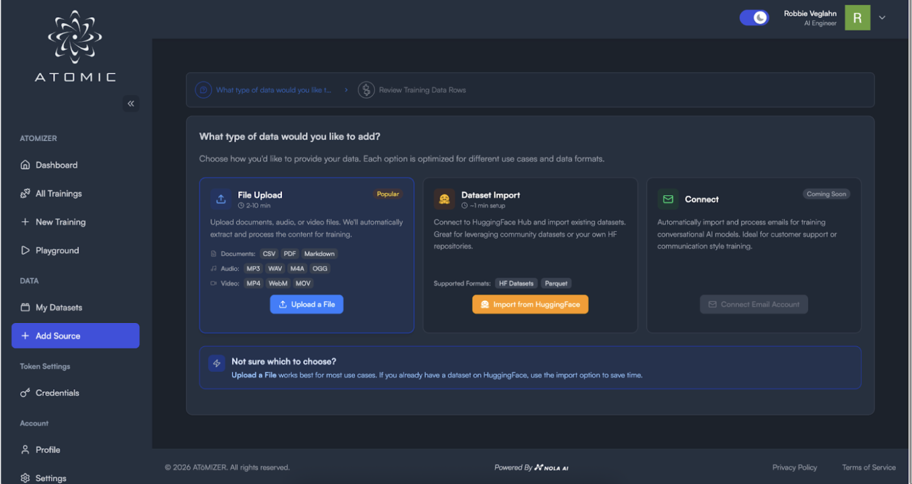
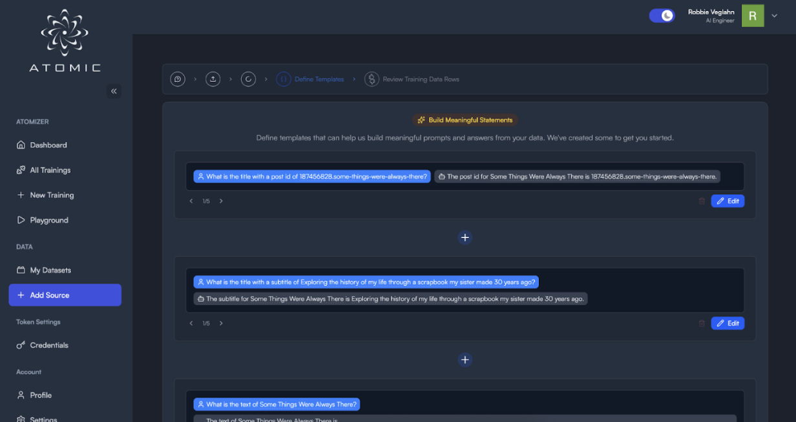
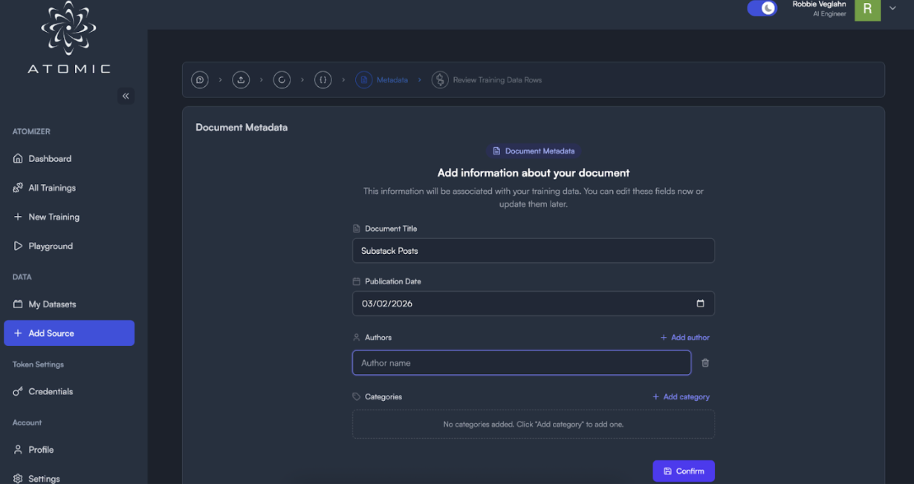
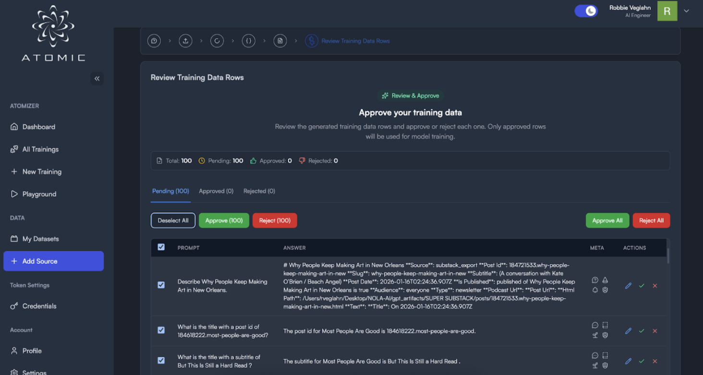
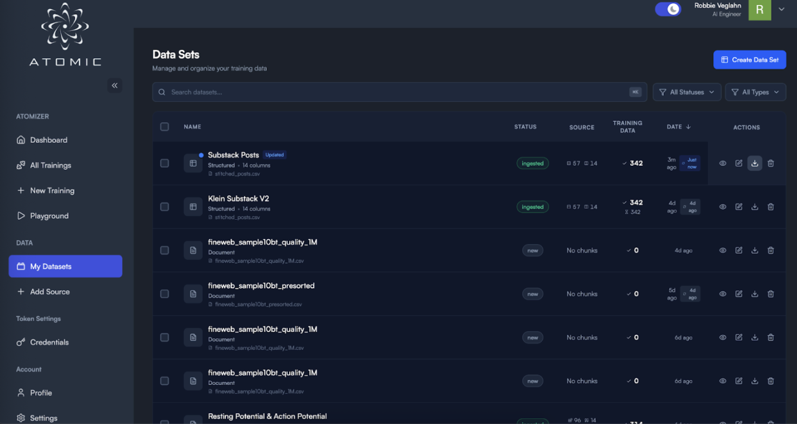
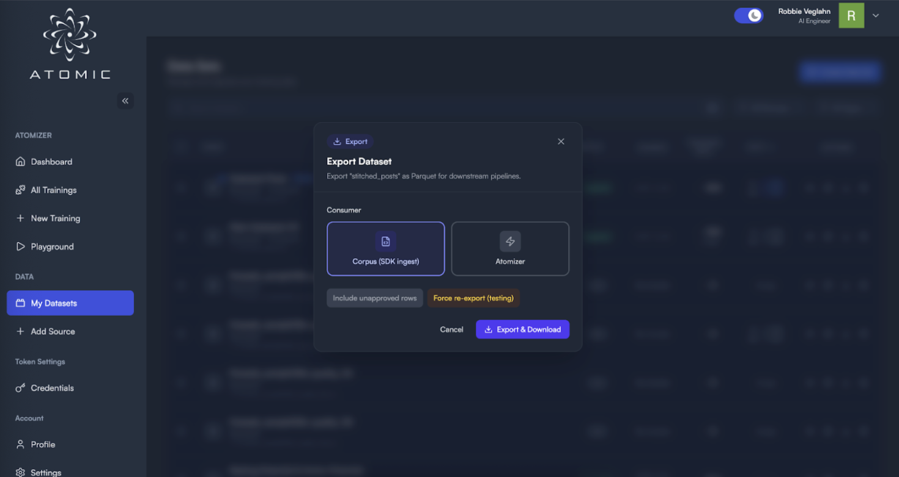

# 3. Corpus Cookbooks

```md
# 📚 Corpus Cookbooks

Corpus Cookbooks walk you step-by-step from raw data to a production-ready corpus export compatible with the ATOMIC SDK Ingest pipeline.

All corpus builds follow the same 6 stages:

1. Select Data Source
2. Define Meaningful Templates
3. Add Document Metadata
4. Approve / Reject Generated Training Rows
5. Export Dataset
6. Download as **Corpus (SDK Ingest)**

---

## General Workflow Guide



### Step 1 — Select Dataset Source

You have two ingestion paths:

#### Option A: File Upload

Upload:
- CSV
- Parquet
- JSON
- Markdown
- PDF
- Audio / Video (auto-processed)

Best for:
- Personal datasets
- Exports (Substack, internal docs)
- Slides
- Cleaned corpora

#### Option B: HuggingFace Dataset Import

Connect to Hugging Face and import:
- FineWeb
- Open datasets
- Custom HF repositories

Best for:
- Large public corpora
- Research datasets
- Pre-curated structured data

### Step 2 — Define Meaningful Templates



Templates convert raw rows into structured training statements.

You use:

`@column_name`

to reference dataset fields.

Example:

If your dataset has:

`title`, `subtitle`, `body`

You can define:

**Prompt**  
What is the title of "@title"?

**Answer**  
The title is "@title".

Or:

**Prompt**  
Summarize the following article:  
@body

**Answer**  
@body

Templates determine:
- How your corpus thinks
- What relationships are encoded
- What kinds of questions the model can answer

Think of this step as **schema design for intelligence**.

### Step 3 — Add Metadata



Attach contextual grounding:
- Document Title
- Publication Date
- Authors
- Categories

Metadata improves:
- Filtering
- Retrieval ranking
- Attribution logic
- Contextual inference

Best practice:

Use consistent categories like:
- Newsletter
- Academic
- Conversation
- Research
- Lecture

### Step 4 — Approve Training Rows



The system generates candidate prompt/answer rows.

You can:
- Approve individually
- Bulk approve
- Reject noisy rows
- Edit specific rows

This is where you control signal quality.

High approval discipline = higher quality corpus.

### Step 5 — Export Dataset



Click **Export**.

Choose:
- Include unapproved rows (usually **No**)
- Force re-export (only if modifying templates)

### Step 6 — Download as “Corpus (SDK Ingest)”



Select:

**Corpus (SDK Ingest)**

This produces a parquet file formatted exactly for downstream ingestion into ATOMIC.

This file is now ready for:
- clear corpus
- ingest parquet
- run inference

---

## 📰 Cookbook A: Substack Articles → Writing Assistant

### Goal

Build a model that writes like you.

### Step 1 — Upload Dataset

Upload:
- `stitched_posts.csv`
- or `stitched_posts.parquet`

Expected columns:
- `title`
- `subtitle`
- `slug`
- `post_date`
- `text`

### Step 2 — Templates

#### Template 1 — Title Retrieval

**Prompt**  
What is the title of the post with id @slug?

**Answer**  
The title is "@title".

#### Template 2 — Subtitle Retrieval

**Prompt**  
What is the subtitle of "@title"?

**Answer**  
The subtitle is "@subtitle".

#### Template 3 — Writing Style Embedding

**Prompt**  
Continue writing in the style of the following article:  
@text

**Answer**  
@text

#### Template 4 — Thematic Summary

**Prompt**  
Summarize the themes of "@title".

**Answer**  
@text

### Step 3 — Metadata

- Title: Substack Posts
- Category: Newsletter, Writing
- Author: Your name
- Date: Original publish date

### Step 4 — Approve

Reject:
- Broken HTML
- Short metadata rows
- Empty text fields

### Step 5–6 — Export → Corpus (SDK Ingest)

This corpus now enables:
- Style imitation
- Topic recall
- Article referencing
- Tone continuation

---

## 🎓 Cookbook B: Academic Slides → Study Bot

### Goal

Create a test-prep assistant.

### Step 1 — Upload

Upload:
- Lecture slides PDF
- Extracted CSV
- Markdown notes

Expected columns:
- `slide_title`
- `slide_number`
- `content`
- `course_name`

### Step 2 — Templates

#### Template 1 — Flashcards

**Prompt**  
What is the key concept in slide @slide_number?

**Answer**  
@content

#### Template 2 — Definition Builder

**Prompt**  
Define the following term:  
@slide_title

**Answer**  
@content

#### Template 3 — Exam Style Question

**Prompt**  
Explain the concept of "@slide_title" as it appears in the course.

**Answer**  
@content

### Step 3 — Metadata

Categories:
- Course Name
- Subject Area
- Exam Type

### Step 4 — Approve

Reject:
- Decorative slides
- Agenda slides
- Empty bullet pages

### Export → Corpus (SDK Ingest)

Result:
- Retrieval-aware study assistant
- Flashcard generator
- Contextual answer bot

---

## 🌐 Cookbook C: FineWeb from HuggingFace → Knowledge Corpus

### Goal

Import a large web-scale corpus.

### Step 1 — HuggingFace Import

Select:

`Dataset Import → HuggingFace`

Choose:

`HuggingFaceH4/fineweb`

or your desired subset.

### Step 2 — Templates

FineWeb typically contains:
- `text`
- `metadata`
- `url`

#### Template 1 — Contextual QA

**Prompt**  
Answer a question based on the following web content:  
@text

**Answer**  
@text

#### Template 2 — Factual Extraction

**Prompt**  
Extract key facts from this article:  
@text

**Answer**  
@text

#### Template 3 — URL Grounded

**Prompt**  
What information does the page @url contain?

**Answer**  
@text

### Step 3 — Metadata

Category:
- Web
- FineWeb
- Public Corpus

### Step 4 — Approve Strategically

Because FineWeb is large:
- Consider sampling
- Reject malformed HTML
- Reject very short entries

### Export → Corpus (SDK Ingest)

This produces a large structured parquet corpus ready for SDK ingestion.

---

## Best Practices Across All Cookbooks

1. Templates define intelligence.  
   Spend time here.

2. Reject noise aggressively.  
   Garbage in → garbage graph.

3. Use categories consistently.  
   They become retrieval filters.

4. Separate corpora by use case.  
   Don’t mix:
   - Writing style
   - Academic facts
   - Conversations
   - Web crawl

---

## What Happens Next

After downloading:

`corpus.parquet`

You can:
- clear corpus
- ingest parquet
- run inference

The system now reasons over structured, template-encoded knowledge.